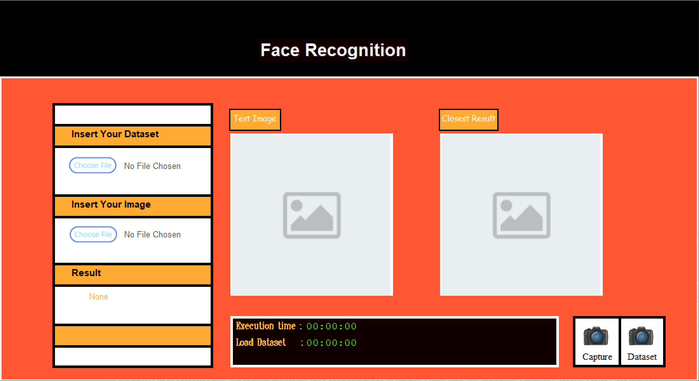

# Face Recognition with EigenFace Algorithm
> Source Code ini dibuat oleh kami, Kelompok 11, untuk memenuhi Tugas Besar 2 - Aljabar Linear dan Geometri IF2123 yaitu mengimplementasikan 
> Aplikasi Nilai Eigen dan EigenFace pada Pengenalan Wajah (Face Recognition)

## Daftar Isi
* [Anggota Kelompok](#anggota-kelompok)
* [Implementasi Program](#implementasi-program)
* [Sistematika File](#sistematika-file)
* [Requirements](#requirements)
* [Cara Menjalankan Program](#cara-menjalankan-program)
* [Screenshots](#screenshots)

## Anggota Kelompok
NIM | Nama |
--- | --- |
13521108 | Michael Leon Putra Widhi |
13521145 | Kenneth Dave Bahana |
13521172 | Nathan Tenka

## Implementasi Program
Pada Tugas Besar kali ini, program yang kami buat dapat digunakan untuk :
1. Program melakukan pencocokan wajah dengan koleksi wajah yang ada di folder yang telah dipilih. Metrik untuk pengukuran kemiripan menggunakan eigenface + jarak euclidean.
2. Program menampilkan 1 hasil pencocokan pada dataset yang paling dekat dengan gambar input atau memberikan pesan jika tidak didapatkan hasil yang sesuai.
3. Program menghitung jarak euclidean dan nilai eigen & vektor eigen yang ditulis. Tidak boleh menggunakan fungsi yang sudah tersedia di dalam library atau Bahasa Python.
4. [BONUS] Terdapat fitur kamera yang dapat mengenali wajah secara realtime menggunakan webcam ketika program dijalankan dengan mekanisme pengambilan gambar yang dibebaskan.

## Sistematika File
```bash
.
├─── doc
├─── src
│   ├─── GUI
│   │   ├─── images
│   │   └─── interface.py
|   ├─── camRecord.py
|   ├─── cobaOpenCV.py
|   ├─── CobaQRDecomp.py
|   ├─── Eigenface.py
|   └─── webcam.py
├─── test
│   ├─── Dataset
│   ├─── Face Cam Data
│   └─── Gambar Uji
├─── Average face.jpg
├─── testImg.jpg
└─── README.md
```

## Requirements
***Libraries***<br />
* Tkinter<br />
* Pillow<br />
* OpenCV<br />
* Glob<br />
* Schedule<br />
* Time<br />
* Threading<br />
* Numpy<br />
* Math<br />

## Cara Menjalankan Program

### Menjalankan GUI
1. Pastikan Python 3 versi terbaru sudah terpasang pada mesin eksekusi (Anda dapat mengecek versi Python 3 dengan menjalankan command `python --version` pada command prompt).
2. Lakukan pemindahan posisi folder directory ke source code dengan command `cd src`.
3. Jalankan run pada `interface.py`.
4. Jika berhasil dikompilasi, maka akan muncul tampilan GUI dan program siap digunakan.

### Melakukan Pencocokan Wajah dengan Eigenface
1. Masukkan dataset yang ingin dianalisis dengan menekan tombol `Choose File` pada bagian "Insert Your Dataset", Tunggu hingga proses pembacaan dan pengenalan dataset selesai dilakukan.
2. Masukkan gambar yang ingin dicari kemiripannya dengan menekan tombol `Choose File` pada bagian "Insert Your Image", Jika berhasil maka akan muncul gambar yang ditambahkan pada bagian "Test Image".
3. Sesaat kemudian akan muncul sebuah wajah dari dalam database yang memiliki kemiripan dari eigenface dengan jarak euclidean terpendek pada bagian "Closest Result" jika gambar yang sesuai ditemukan pada dataset yang dimasukkan.

### Melakukan Perekaman Wajah dan Menjadikannya Dataset
1. Proses perekaman gambar akan dimulai sesaat setelah Anda menekan tombol `Dataset`.
2. Tunggu proses perekaman berlangsung dan sebuah database berjumlah 30 gambar akan tersimpan di dalam folder `Face_Cam_Data`.

### Melakukan Perekaman dan Pengenalan Wajah Secara ***Realtime***
1. Masukkan dataset yang ingin dianalisis dengan menekan tombol `Choose File` pada bagian "Insert Your Dataset", Tunggu hingga proses pembacaan dan pengenalan dataset selesai dilakukan.
2. Masukkan gambar dengan nama file `image_webcam.jpg` dengan menekan tombol `Choose File` pada bagian "Insert Your Image", Jika berhasil maka akan muncul gambar yang ditambahkan pada bagian "Test Image".
3. Tekan tombol `Capture` dan sebuah wajah dari dalam database yang memiliki kemiripan dari eigenface dengan jarak euclidean terpendek akan muncul pada bagian "Closest Result".
4. Proses penghentian pengambilan gambar dapat dilakukan dengan menekan tombol `Stop`.

## Screenshots

